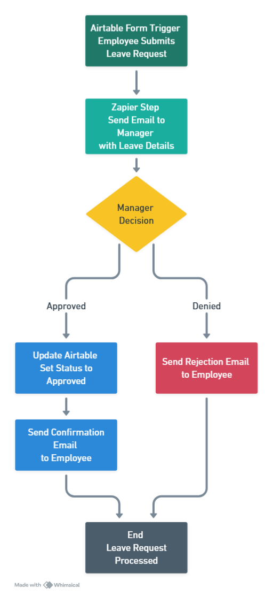

# Employee Leave Request Management

An automated system built with **Airtable** and **Zapier** to handle leave requests, manager approvals, and automatic balance deductions.

### Workflow Diagram


### Automation Logic
```json
{
  "trigger": "Airtable Form: Employee Submits Leave Request",
  "step_1": "Zapier: Send Email to Manager with Details",
  "decision": "Manager Approval or Denial",
  "path_approved": [
    "Update Airtable: Set Status to Approved",
    "Action: Auto-deduct Leave Balance from Record",
    "Send Email: Confirmation to Employee"
  ],
  "path_denied": [
    "Send Email: Rejection to Employee"
  ],
  "end": "Leave Request Processed"
}
